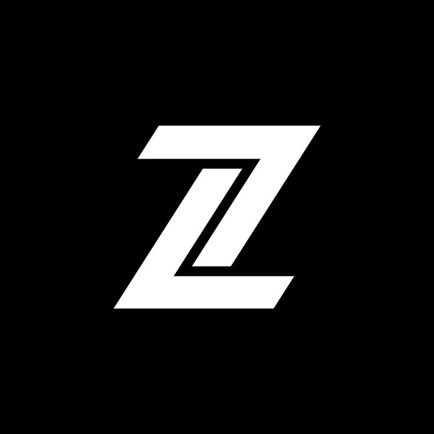

<!-- Improved compatibility of back to top link: See: https://github.com/othneildrew/Best-README-Template/pull/73 -->

<a id="readme-top"></a>

<!--
*** Thanks for checking out the Best-README-Template. If you have a suggestion
*** that would make this better, please fork the repo and create a pull request
*** or simply open an issue with the tag "enhancement".
*** Don't forget to give the project a star!
*** Thanks again! Now go create something AMAZING! :D
-->

<!-- PROJECT SHIELDS -->
<!--
*** I'm using markdown "reference style" links for readability.
*** Reference links are enclosed in brackets [ ] instead of parentheses ( ).
*** See the bottom of this document for the declaration of the reference variables
*** for contributors-url, forks-url, etc. This is an optional, concise syntax you may use.
*** https://www.markdownguide.org/basic-syntax/#reference-style-links
-->

[![Contributors][contributors-shield]][contributors-url]
[![Forks][forks-shield]][forks-url]
[![Stargazers][stars-shield]][stars-url]
[![Issues][issues-shield]][issues-url]
[![project_license][license-shield]][license-url]
[![LinkedIn][linkedin-shield]][linkedin-url]

<!-- PROJECT LOGO -->
<br />
<div align="center">
  <a href="https://github.com/ayemteezy/teezy">
    
  </a>

<h3 align="center">Teezy</h3>

  <p align="center">
    A personal portfolio site built to showcase projects, experience, certifications, and testimonials — with live project data pulled from GitHub instead of being hand-maintained.
    <br />
    <a href="https://github.com/ayemteezy/teezy"><strong>Explore the docs »</strong></a>
    <br />
    <br />
    <a href="https://teezy-dev.vercel.app">View Demo</a>
    &middot;
    <a href="https://github.com/ayemteezy/teezy/issues/new?labels=bug&template=bug-report.md">Report Bug</a>
    &middot;
    <a href="https://github.com/ayemteezy/teezy/issues/new?labels=enhancement&template=feature-request.md">Request Feature</a>
  </p>
</div>

<!-- TABLE OF CONTENTS -->
<details>
  <summary>Table of Contents</summary>
  <ol>
    <li>
      <a href="#about-the-project">About The Project</a>
      <ul>
        <li><a href="#built-with">Built With</a></li>
      </ul>
    </li>
     <li>
      <a href="#getting-started">Getting Started</a>
      <ul>
        <li><a href="#prerequisites">Prerequisites</a></li>
        <li><a href="#installation">Installation</a></li>
        <li><a href="#environment-variables">Environment Variables</a></li>
      </ul>
    </li>
    <li><a href="#usage">Usage</a></li>
    <li><a href="#roadmap">Roadmap</a></li>
    <li><a href="#contributing">Contributing</a></li>
    <li><a href="#license">License</a></li>
    <li><a href="#contact">Contact</a></li>
    <li><a href="#acknowledgments">Acknowledgments</a></li>
  </ol>
</details>

<!-- ABOUT THE PROJECT -->

## About The Project

[![Teezy Screen Shot][product-screenshot]](https://teezy-dev.vercel.app)
 
Teezy is my personal portfolio — a single-page site organized into distinct sections (Stack, Projects, Experience, Certifications, Testimonials) rather than a static one-pager. Pinned projects aren't hand-typed: they're pulled live from the GitHub GraphQL API, so the site reflects what I'm actually building, not a snapshot from whenever I last updated it.
 
The application features:
 
- Pinned GitHub repositories fetched live via the GitHub GraphQL API, with per-repo language and topic tags
- Structured, data-driven sections for Experience, Certifications, and Testimonials rather than hardcoded markup
- Logo lookups via logo.dev for certification issuers and project tech
- A responsive mobile sidebar with scroll-lock and click-outside-to-close behavior
This project emphasizes clean component architecture, server-side data fetching, and a consistent, restrained design system across every section rather than a grab-bag of styles.
 
<p align="right">(<a href="#readme-top">back to top</a>)</p>

### Built With

- [![React][React]][React-url]
- [![TypeScript][TypeScript]][TypeScript-url]
- [![TanStackStart][TanStackStart]][TanStackStart-url]
- [![TailwindCSS][TailwindCSS]][TailwindCSS-url]
- [![Bun][Bun]][Bun-url]
- [![Biome][Biome]][Biome-url]


<p align="right">(<a href="#readme-top">back to top</a>)</p>

<!-- GETTING STARTED -->

## Getting Started

To get a local copy up and running, follow these steps.

### Prerequisites

- [Bun](https://bun.sh) installed globally
- A GitHub personal access token (for pinned repos)

### Installation

1. Clone the repo

```sh
git clone https://github.com/ayemteezy/teezy.git
```

2. Install dependencies

```sh
bun install
```

3. Set up your environment variables (see below), then run the dev server

```sh
bun run dev
```

<p align="right">(<a href="#readme-top">back to top</a>)</p>

### Environment Variables
 
Create a `.env` file in the project root with the following:
 
```env
 GITHUB_TOKEN=your_github_token
 VITE_LOGO_DEV_TOKEN=your_logo_dev_publishable_key
```
 
<p align="right">(<a href="#readme-top">back to top</a>)</p>

<!-- USAGE EXAMPLES -->

## Usage

1. Run `bun run dev` and open `http://localhost:3000`
2. Pinned projects populate automatically from the GitHub API
3. Static content (Experience, Certifications, Testimonials, Stack) is edited directly in `src/constants/`

<p align="right">(<a href="#readme-top">back to top</a>)</p>

<p align="right">(<a href="#readme-top">back to top</a>)</p>

<!-- ROADMAP -->

## Roadmap

- [x] GitHub pinned repos integration
- [x] Certifications with logo.dev lookups
- [x] Testimonials section
- [ ] Light/dark theme support
- [ ] Dedicated blog section

See the [open issues](https://github.com/ayemteezy/teezy/issues) for a full list of proposed features (and known issues).

<p align="right">(<a href="#readme-top">back to top</a>)</p>

<!-- CONTRIBUTING -->

## Contributing

Contributions are what make the open source community such an amazing place to learn, inspire, and create. Any contributions you make are **greatly appreciated**.

If you have a suggestion that would make this better, please fork the repo and create a pull request. You can also simply open an issue with the tag "enhancement".
Don't forget to give the project a star! Thanks again!

1. Fork the Project
2. Create your Feature Branch (`git checkout -b feature/AmazingFeature`)
3. Commit your Changes (`git commit -m 'Add some AmazingFeature'`)
4. Push to the Branch (`git push origin feature/AmazingFeature`)
5. Open a Pull Request

<p align="right">(<a href="#readme-top">back to top</a>)</p>

### Top contributors:

<a href="https://github.com/ayemteezy/teezy/graphs/contributors">
  
</a>

<!-- LICENSE -->

## License

Distributed under the MIT License. See `LICENSE` for more information.

<p align="right">(<a href="#readme-top">back to top</a>)</p>

<!-- CONTACT -->

## Contact

- Twitter/X: [@ayemteezy\_](https://x.com/ayemteezy_)
- Email: [laurencelestercarino@gmail.com](mailto:laurencelestercarino@gmail.com)
- GitHub: [ayemteezy](https://github.com/ayemteezy)

Project Link: [https://github.com/ayemteezy/tic-tac-toe](https://github.com/ayemteezy/tic-tac-toe)

<p align="right">(<a href="#readme-top">back to top</a>)</p>

<!-- ACKNOWLEDGMENTS -->

## Acknowledgments

- [GitHub GraphQL API](https://docs.github.com/en/graphql) — for pinned repository data
- [logo.dev](https://logo.dev) — for issuer and tech logos
- [shadcn/ui](https://ui.shadcn.com/) — for base component primitives
- [Geist](https://vercel.com/font) — for the typeface family

<p align="right">(<a href="#readme-top">back to top</a>)</p>

<!-- MARKDOWN LINKS & IMAGES -->
<!-- https://www.markdownguide.org/basic-syntax/#reference-style-links -->

[contributors-shield]: https://img.shields.io/github/contributors/ayemteezy/teezy.svg?style=for-the-badge
[contributors-url]: https://github.com/ayemteezy/teezy/graphs/contributors
[forks-shield]: https://img.shields.io/github/forks/ayemteezy/teezy.svg?style=for-the-badge
[forks-url]: https://github.com/ayemteezy/teezy/network/members
[stars-shield]: https://img.shields.io/github/stars/ayemteezy/teezy.svg?style=for-the-badge
[stars-url]: https://github.com/ayemteezy/teezy/stargazers
[issues-shield]: https://img.shields.io/github/issues/ayemteezy/teezy.svg?style=for-the-badge
[issues-url]: https://github.com/ayemteezy/teezy/issues
[license-shield]: https://img.shields.io/github/license/ayemteezy/teezy.svg?style=for-the-badge
[license-url]: https://github.com/ayemteezy/teezy/blob/main/LICENSE.txt
[linkedin-shield]: https://img.shields.io/badge/-LinkedIn-black.svg?style=for-the-badge&logo=linkedin&colorB=555
[linkedin-url]: https://www.linkedin.com/in/laurence-lester-cari%C3%B1o/
[product-screenshot]: public/images/og-image.jpg

<!-- Shields.io badges. You can a comprehensive list with many more badges at: https://github.com/inttter/md-badges -->
 
[React]: https://img.shields.io/badge/react-%2320232a.svg?style=for-the-badge&logo=react&logoColor=%2361DAFB
[React-url]: https://react.dev/
[TypeScript]: https://img.shields.io/badge/typescript-%23007ACC.svg?style=for-the-badge&logo=typescript&logoColor=white
[TypeScript-url]: https://www.typescriptlang.org/
[TanStackStart]: https://img.shields.io/badge/tanstack_start-ECE8D1?style=for-the-badge&logo=tanstack&logoColor=black&labelColor=ECE8D1&color=ECE8D1
[TanStackStart-url]: https://tanstack.com/start
[TailwindCSS]: https://img.shields.io/badge/tailwindcss-%2338B2AC.svg?style=for-the-badge&logo=tailwind-css&logoColor=white
[TailwindCSS-url]: https://tailwindcss.com/
[Bun]: https://img.shields.io/badge/bun-%23000000.svg?style=for-the-badge&logo=bun&logoColor=white
[Bun-url]: https://bun.sh/
[Biome]: https://img.shields.io/badge/biome-%2360A5FA.svg?style=for-the-badge&logo=biome&logoColor=white
[Biome-url]: https://biomejs.dev/
